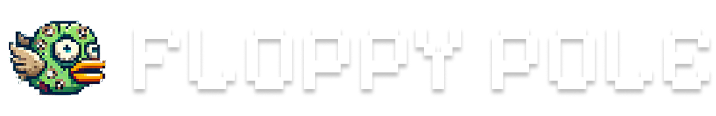
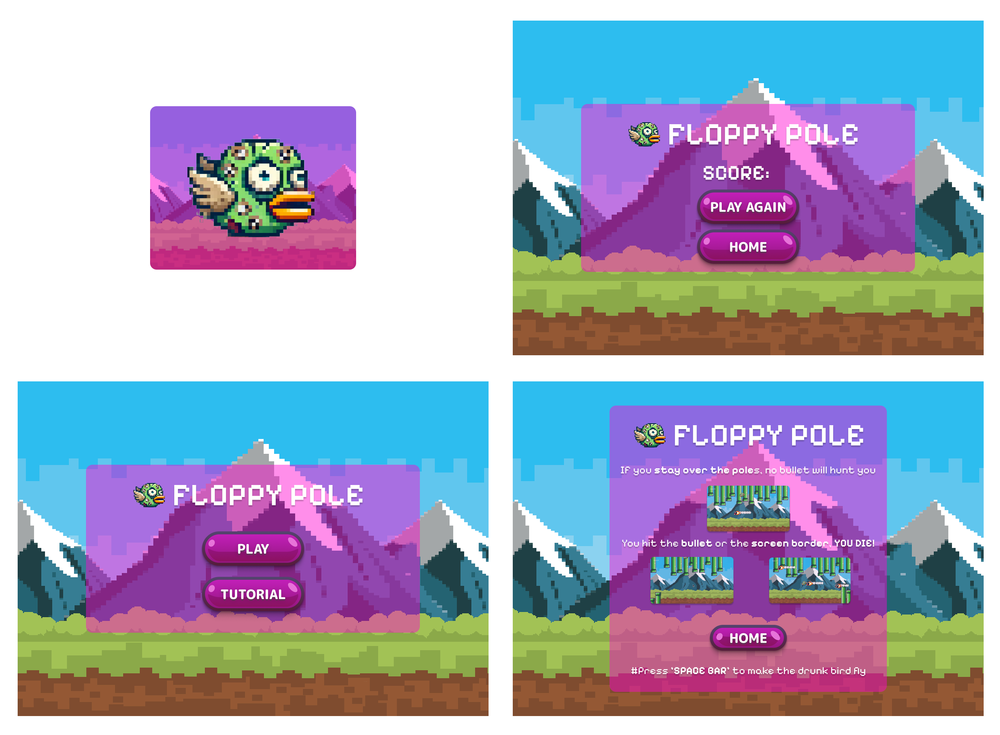

# Flappy Pole

**Flappy Pole** is a fast-paced, reaction-based arcade game developed during **March Game Jam 2025**. It's a wild twist on the Flappy Bird genre—where going *through* the pipes spells doom. That's right: **your bird must fly *over* each pipe** to survive. If you dare slip through the gap, a deadly bullet is fired to hunt you down!
[(CLICK HERE TO DOWNLOAD THE GAME)](https://zhasan0110gmailcom.itch.io/floppy-pole).

## 🎮 Gameplay Overview

In Flappy Pole, your mission is simple: **stay alive**. But here's the catch:

- 🟢 **Go over the pipe** to avoid triggering bullets.
- 🔴 **Go through the pipe gap**, and a bullet will shoot toward you!
- 💥 One hit—whether by pipe or bullet—and it's game over.

Your reflexes will be tested. The tension builds as your score climbs higher.

## ✨ Features

- 🐦 Smooth and responsive bird controls
- 🔫 Unique bullet hazard system that punishes going through pipes
- 🔊 Dynamic audio effects for jumps, bullets, collisions, and more
- 🎮 Simple yet addictive gameplay loop
- 🧠 Tutorial overlay for first-time players
- 📊 Real-time score tracking with a stylish Game Over screen
- 📋 Menu navigation and restart system

## 🖥️ Platform & Requirements

| Item            | Details              |
|-----------------|----------------------|
| Platform        | Windows (.exe)       |
| Input           | Spacebar    |
| Download Format | Standalone Executable|

> The game is currently available only for **Windows** via `.exe` build.

## 🧪 How to Run

1. **Download the `.exe` file** from the release section [(click here)](https://zhasan0110gmailcom.itch.io/floppy-pole).
2. Run `FlappyPole.exe` on your Windows machine.
3. Click “Play” and begin your flight!

## 🕹 Controls

| Action         | Input         |
|----------------|---------------|
| Flap / Jump    | Spacebar |
| Start Game     | Click "Play" |
| Menu Navigation| Mouse         |

## 📦 Project Structure

- `main.gd` – Core gameplay loop and scene transitions
- `birdScript.gd` – Controls bird movement and physics
- `pipeScript.gd` – Manages pipe positions and bullet logic
- `bulletScript.gd` – Bullet spawn and collision behavior
- `menuScript.gd` – Menu UI functionality
- `tutorialScript.gd` – Displays gameplay instructions
- `gameOverScript.gd` – Game over handling and restart
- `scoreScript.gd` – Score tracking and display
- `.tscn files` – Scenes for Menu, Main gameplay, and Bird

## 🛠️ Tools Used
- Figma
- Godot

## 🎞️ Wireframe

## 👥 Credits

Developed by our team during **Game Jam 2025**:

- 🧑 Hasan Zahid
- 🧑 Nadman Abdulla Bin Faisal
- 🧑 Filipe Araújo Veras Rosa
- 🧑 Mohamed Taha Jasser

## 📜 License

This project was created for Game Jam 2025. Distribution and usage rights may vary—please contact the team for permission if you'd like to reuse or adapt any part of the game.

---

> 💡 **Pro Tip:** Don't flap through danger—go over it!

